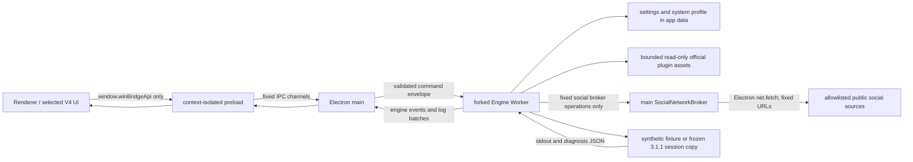

# Runtime architecture

## Ownership

- Renderer owns presentation only. It cannot name IPC channels or touch OS APIs.
- Preload validates every call and freezes the exposed API object.
- Main accepts IPC only from the canonical selected entry in its one bound main window/main frame. It owns one Worker and only direct child PID cleanup. No process-name enumeration or tree kill exists.
- Worker owns settings/profile/report writes and any PowerShell process it starts.
- `EngineAdapter` never changes the frozen source. It creates an isolated session copy and a derived `Config/storage.ini` under application data.

## Frontend integration boundary

- Development may use the built-in fallback only when `frontend/dist` is absent. A packaged Runtime refuses to start without the integrated `index.html` and integration manifest.
  - `sync:frontend` has no caller-controlled path. It reads only fixed adjacent `../design-lab/dist`, validates bounded regular files and local HTML/CSS/JavaScript references, then hashes every file.
- The complete dist and `.winbridge-frontend-manifest.json` are assembled and verified in a same-parent staging directory before directory replacement. A failed source/staging validation never replaces the prior complete dist.
- `verify:frontend`, `pack:check`, and `pack:win` require exact file count, total size, paths, hashes, index hash, reference graph, and absence of unresolved staging/previous directories.

## Production renderer CSP

- Every BrowserWindow uses the dedicated non-persistent Electron session partition `winbridge-v4-runtime`; permission and response interception policy is confined to that Runtime session.
- Packaged mode installs the response-header policy before `loadFile`. The handler is bound to the canonical integrated `index.html` URL, its current `webContents.id`, and `resourceType="mainFrame"`, so replacing `frontend/dist` through the controlled sync process cannot omit CSP.
- The enforced policy is: `default-src 'self'; script-src 'self'; style-src 'self' 'unsafe-inline'; img-src 'self' data:; connect-src 'none'; object-src 'none'; base-uri 'none'; frame-src 'none'; form-action 'none'`.
- Existing CSP response headers are replaced rather than merged with a possibly weaker policy. `unsafe-eval`, HTTP/HTTPS renderer connections, forms, objects, frames, and base-URL rewriting are not enabled.
- Development mode does not install the production response interceptor, preserving the existing local Vite/fallback workflow. The built-in fallback also carries the same closed meta policy as defense in depth.
- Social feed networking does not require a renderer `connect-src` exception: all requests remain behind the validated Worker/main Electron `net.fetch` broker.

## Event contract

- Worker supplies trusted `actualProgress` and opaque `engineStageState`.
- Main projection owns `displayedProgress` and `presentedStageState`.
- Displayed progress is monotonic and never exceeds actual progress.
- Failure and cancellation bypass ordinary queues and latch terminal presentation.
- Only `ResultReady` with `finalVerificationPassed=true` may set actual/displayed progress to 100.
- `ResultReady` does not authorize automatic closing. `autoCloseAfterRepair` defaults false and requires an explicit setting marker.

## Read/write sequencing

- Synthetic/read-only discovery tasks use a bounded pool.
- Reports are deterministically ordered after concurrent discovery.
- Real repair, backup, replacement, registry, rollback and final verification are not reimplemented. If enabled later, the frozen 3.1.1 entrypoint retains its original order.
- A diagnosis report never automatically invokes repair. `startRepair(reportId)` is a separate explicit command with policy gates.
- Real-repair capability requires both Electron packaged state and the exact `--enable-real-repair` startup switch. The switch cannot replace current-report, expiry, category, or explicit-call gates.
- Repair authorization trusts only a report generated successfully in the current Worker lifetime. Persisted JSON is audit output, not an authorization token; restart, a new diagnosis attempt, or repair start invalidates/consumes the in-memory eligibility.

## Official plugin assets

- `getPluginAssets()` has no parameters and recognizes only `browser`, `chrome`, and `computer-use`.
- Worker derives the current `CODEX_HOME`, canonicalizes each allowed `openai-bundled` base, plugin root, manifest, and logo file, and applies `path.relative` containment at every boundary.
- Manifest reads are capped at 256 KiB. Image reads are capped at 2 MiB and require both an approved PNG/WebP/JPEG extension and matching binary signature.
- Files are read with bounded file-handle reads. No asset is copied or written. Returned objects contain only an in-memory data URL, display name, version, and SHA-256.
- Each plugin is isolated: a missing, malformed, oversized, redirected, or unsupported asset becomes only `{ available: false }` for that plugin.

## Read-only social runtime

- Renderer sees only three typed methods. It cannot submit a URL, host, path, header, arbitrary body, or free translation text.
- Worker accepts only the fixed account enum, applies settings, issues at most three account scans concurrently, parses bounded source data, enforces the 24–72 hour range, keeps at most ten returned posts, and registers the current post set.
- Only canonical UTC timestamps that parse exactly, are at or after the selected window start, and are no more than five minutes ahead of the local clock may enter a feed. The fixed five-minute ceiling covers minor publisher/local clock skew only. Missing, invalid, `timeUnconfirmed`, old, and farther-future records are discarded; Jina currently yields zero posts when it cannot supply trustworthy time.
- `maxPosts` is only an upper bound; zero, one, or two current posts are valid and old records are never backfilled. Source acceptance, the cache-write candidate list, and cache fallback all use the same `orderAndFilter` hard-window function. Cache normalization additionally refuses unconfirmed or non-canonical timestamps.
- Worker-to-main networking is a private bidirectional RPC with only `social.fetch-source`, `social.register-posts`, and `social.translate-post`. Main revalidates each payload, constructs the fixed URL itself, rejects redirects and unexpected content types, caps response bytes, and returns only `{ status, contentType, body }`.
- Main uses Electron `net.fetch`, so requests follow Electron/Chromium system networking. Requests set `credentials: "omit"`, never import browser cookies, and do not accept renderer headers or proxy credentials.
- Translation requires a currently registered `postId` and fixed target locale. Main reconstructs the translation request from the text bound to that registration; the Worker and renderer never provide a translation URL.
- Opening a post is separately gated by both the Worker's current registry and the main broker's current registry, followed by canonical `https://x.com/<allowed-handle>[/status/<digits>]` validation before `shell.openExternal`.
- Cache is confined to application user data under `runtime-v4/social`, is atomically replaced, and is bounded to 24 posts / 512 KiB. It is never a repair authorization input.

## Shutdown

1. Main marks shutdown before cleanup; IPC handlers and Manager reject new work.
2. Worker marks shutdown before cleanup, rejects later requests, cancels read-only tasks and outstanding private broker RPCs, and terminates only its tracked direct PowerShell/helper PID.
3. The main social broker aborts only its own active `net.fetch` controllers, clears registered social posts, and discards late Worker responses.
4. Main waits a bounded interval, then terminates only the forked Worker PID if necessary.
5. No hook searches for or kills ChatGPT, Codex, Chrome or Edge.
